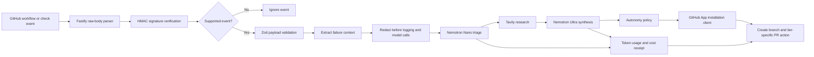

# Phase 2: Core Architecture

## Scope

Resonance Core accepts GitHub Actions failure events, validates their authenticity and shape, builds a sanitized failure context, then runs triage, research, synthesis, policy routing, and a GitHub action. The dashboard is currently a standalone demonstration surface; it is not yet connected to API event state.

## Request Flow

## Ownership Boundaries

| Component | Responsibility |
| --- | --- |
| `apps/api/src/index.ts` | Fastify setup, raw JSON retention, route registration, error handling, startup and shutdown |
| `apps/api/src/routes/webhook.ts` | GitHub signature checks, event filtering, schema validation, and pipeline handoff |
| `apps/api/src/utils/sanitize.ts` | Redaction of webhook log fields and model-bound error text |
| `apps/api/src/services/pipeline.ts` | Nano -> Tavily -> Ultra orchestration, token accounting, fix-package assembly |
| `apps/api/src/services/autonomy-router.ts` | Risk routing, action selection, PR body and receipt formatting |
| `apps/api/src/services/github-client.ts` | App authentication, installation tokens, branches, trees, commits, and PRs |
| `packages/shared/src/schemas` | Runtime validation and shared contracts across packages |
| `apps/dashboard` | Demo-only pipeline visualization; API integration remains future work |

## Failure Handling

- Missing or invalid signatures are rejected before event processing.
- Unsupported event types return an ignored result without entering the pipeline.
- Malformed supported events fail closed with `400`.
- Pipeline errors are returned as a generic server error in production; detailed errors are kept in server logs after sanitization boundaries.
- Provider calls are not part of the in-process smoke tests. Live credentials, rate limits, retries, and the end-to-end PR path still require a separately controlled integration environment.

## Current Limits

- GitHub Actions log retrieval is a placeholder; the webhook route currently supplies a representative failure string.
- The synthesis diff-to-tree conversion is intentionally simplified and must not be treated as a production patch-application mechanism.
- Tier 3 does not have a verified merge implementation. It creates a branch and may open a PR to `dev`; automatic merge behavior must remain disabled until separately implemented and tested.
- The dashboard does not consume API events or persisted state.